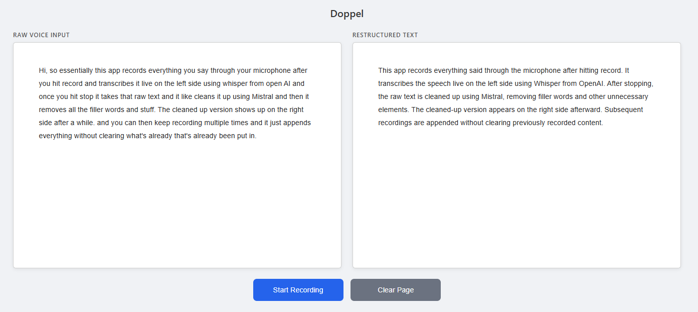
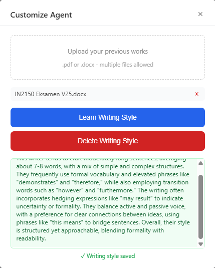

# Doppel

Live speech-to-text transcription with automatic cleanup, powered by Whisper and Ollama.

Record from your mic, see raw transcription on the left panel and polished text output on the right.



## Style Learning

Upload your own documents and Doppel learns your style, so cleaned output matches your natural writing. It runs two passes through deepseek-r1:14b. The first analyses the mechanical patterns of your writing (sentence length, vocabulary, transitions, voice), and the second distills that analysis into a short style profile that guides all future polishing.



## Getting Started

Prerequisites:
- Python 3.10+
- [Ollama](https://ollama.com) installed and running (`ollama serve`)
- A microphone

Clone the repo and run this in your terminal of choice:
```
pip install -r requirements.txt
ollama pull deepseek-r1:14b
python app.py
```

Open http://localhost:5000 in your browser. Hit **Start Recording**, talk, hit **Stop**. Raw text appears on the left, cleaned and restructured text streams in on the right.

**Clear Page** wipes both panels. Recording again appends new text without clearing previous output.

## Performance

Benchmarked with Whisper large-v3-turbo and deepseek-r1:14b. An ongoing goal is to reduce inference times while maintaining output quality.

| Task | RTX 3050 6 GB | RTX 3060 Ti 8 GB | RTX 4090 24 GB |
|---|---|---|---|
| Style learning | ~25–35 min | ~10 min | ~3 min |
| Polish (paragraph) | ~3–5 min | ~1 min | ~15–20 sec |
| Transcription | ~10–15 sec | ~3–5 sec | ~1–2 sec |

*RTX 3060 Ti times are measured; others are estimates. The 3050's 6 GB VRAM can't fully hold the 14B model, so Ollama falls back to heavier quantization or partial CPU offload, significantly impacting LLM tasks.*

## Roadmap
- [x] Real-time voice transcription via Whisper large-v3-turbo
- [x] Reformat and clean text with deepseek-r1:14b LLM
- [x] Smart GPU memory sharing between models
- [x] Backend/frontend separation
- [X] Learn your writing style from uploaded docs
- [ ] Optimize restructuring step for less powerful GPUs
- [ ] Pivot to desktop app
- [ ] Packaged installer for publishing (.exe)
- [ ] UI overhaul
